# 길드 주간 기록지 mk3

## 목자
[개요](1. 개요)
[기능](2. 기능)
[설치](3. 설치)
[사용설명서](4. 사용설명서)
[화면-캡쳐를-통한-엑셀-시트-입력-설정](5. 화면 캡쳐를 통한 엑셀 시트 입력 설정)
[데이터-갱신](6. 데이터 갱신)
[업데이트-로그](7. 업데이트 로그)
[그외](8. 그외)

### 1
### 개요
    이 프로그램은 최근에 개편된 길드 시스템에 대하여
    편리하게 길드 기록을 관리하기 위해 제작되었습니다.

### 2
### 기능
    1. 길드의 데이터를 크롤링해와서 저장후 활용합니다.
    2. 가져온 데이터를 기반으로 엑셀파일을 생성하고, 이와 프로그램끼리 연동하여 기록합니다.
    3. 프로그램을 통하여 입력하고 기록들을 그래프로 볼 수 있습니다.
    4. 저장된 기록들은 엑셀파일로 볼 수 있습니다.
    5. 화면인식을 통한 자동 입력

    실행 화면

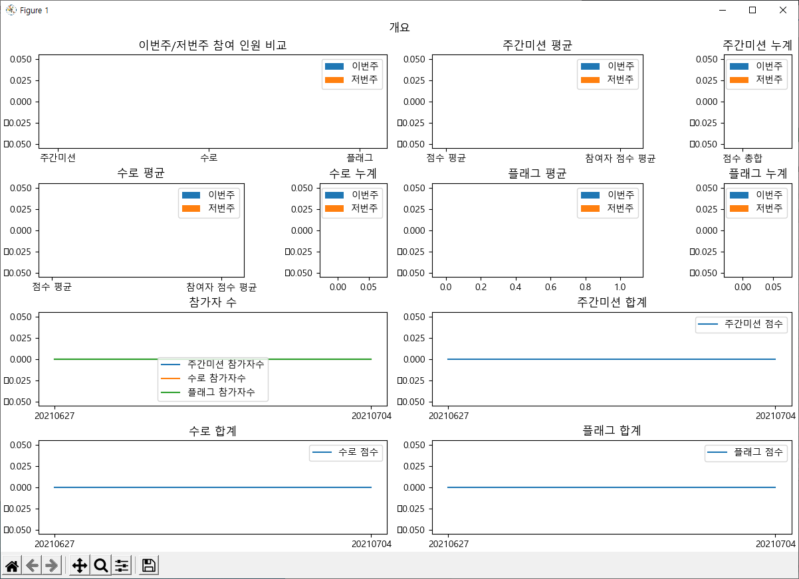
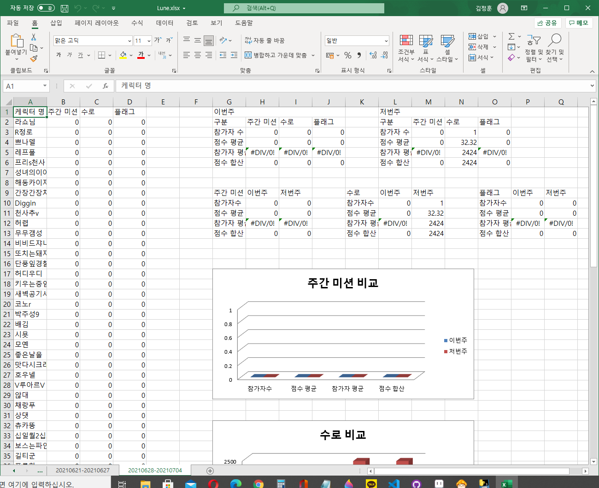

### 3
### 설치

    먼저 파일을 다운로드 받습니다.
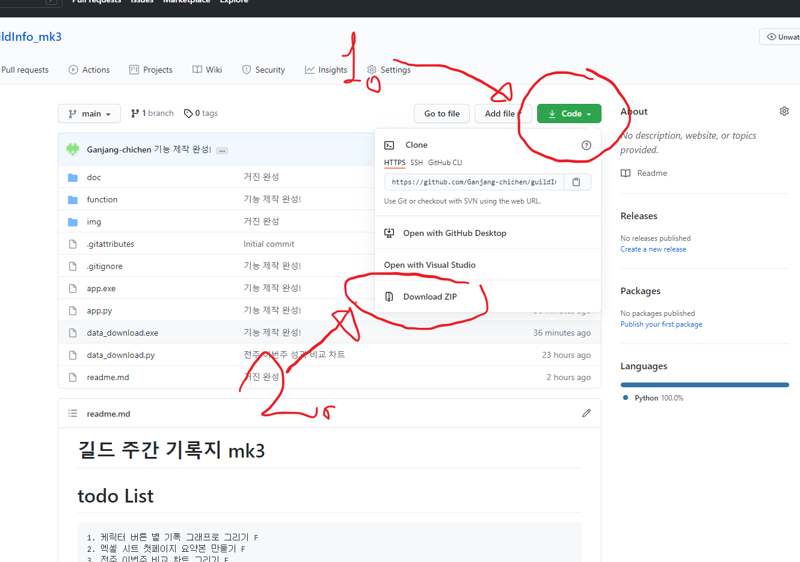
    
    zip 파일을 풉니다.

    이후 폴더내의 data_download.exe 실행파일을 실행시킵니다.

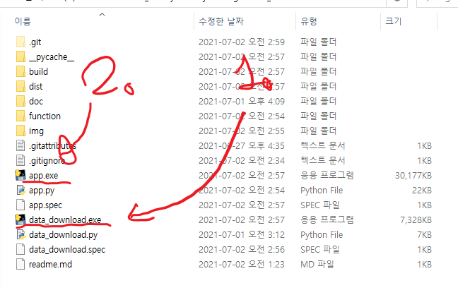

    실행시키면 콘솔 화면이 뜰 것 입니다.

    여기서 시키는대로 길드 이름과 월드를 입력해줍시다.

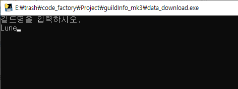
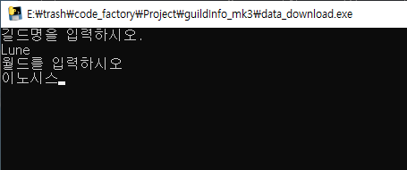

    정상적으로(존재하는 길드를) 입력을 했다면, 데이터가 다운로드될 것 입니다.

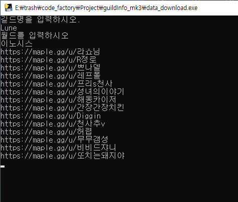
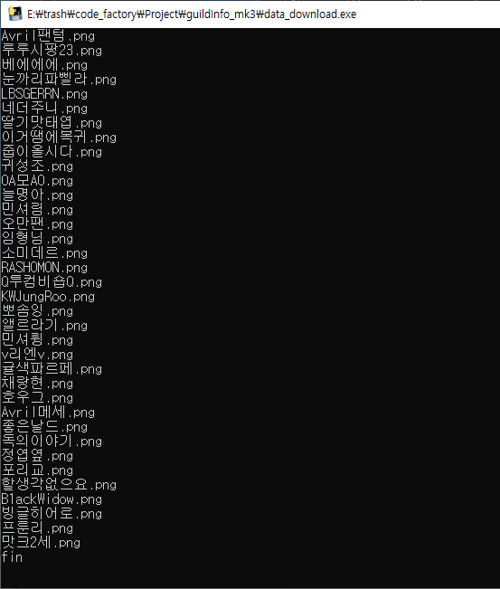

    완료가 되었다면, 이제 app.exe 파일을 실행시킴으로써 프로그램을 실행할 수 있게됩니다.

### 4
### 사용 설명서

##### 4.1
##### 주의사항
    exe파일 등의 위치를 변경하면 정상적으로 동작하지 않을 수 있습니다.
    첫 화면에서도 적혀있지만, 생성된 엑셀파일을 열어두고 프로그램을 실행 시,
    데이터 입력과정에서 오류가 발생합니다.

##### 4.2
##### 실행

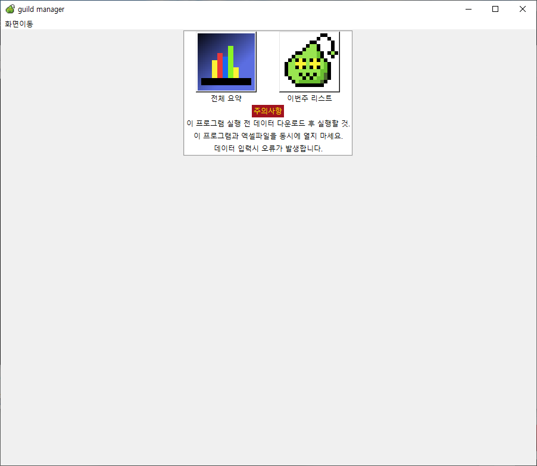
    이전의 설치과정을 정상적으로 완료하였다면,
    프로그램 실행시 위의 화면이 뜰 것 입니다.

##### 4.3
##### 기록 요약창

    처음 실행 시, 전체요약 버튼을 누르면 아래의 화면이 나올 것 입니다.
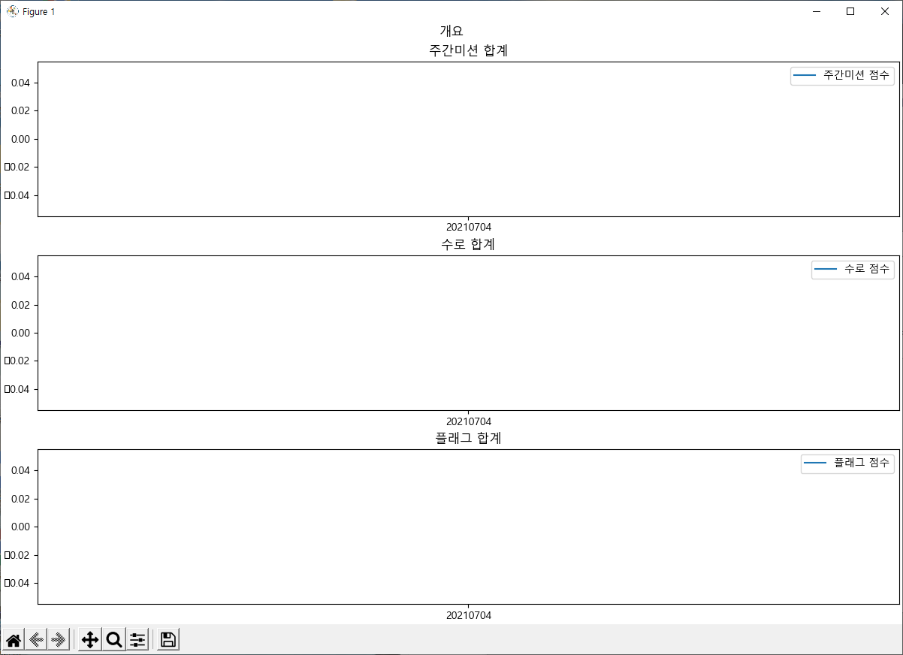

    그런데, 위의 사용예시에서  본 화면과 다릅니다.
    그 이유는 아직 데이터가 1주차 시트밖에 생성되지 않았기 때문입니다.
    프로그램상에서 실행 시 자동적으로 날짜를 파악하여 해당 주차의 시트를 생성하는데,
    아마 다음주에 프로그램을 실행시키게 된다면 다음의 화면이 될 것 입니다.

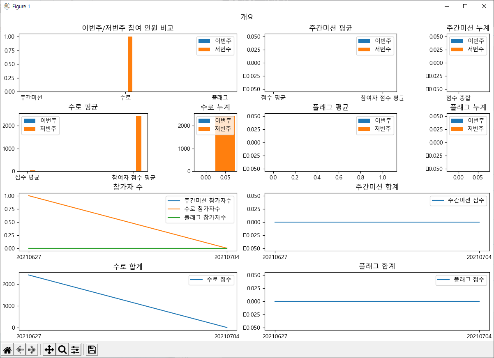

##### 4.4
##### 입력화면

    
    1. 정렬기능입니다.
    데이터를 다운받을때의 기본순서, Lv 높은 순, 이름순으로 정렬가능합니다.
    레벨순으로 정렬 시 같은레벨끼리는 인게임에서의 정렬이 일치하지 않을 수 있습니다.
    
    2. 원하는 주차 데이터를 불러올 수 있습니다.
    20210627-20210704
    2021년 06월 27일(월) - 2021년 07월 04일(일) 을 뜻합니다.
    
    3. 주간 미션 값을 입력하는 곳 입니다.
    버튼을 눌러 선택하면 자동으로 저장이 됩니다.

    4. 지하수로 점수를 입력하는 칸입니다.
    숫자를 입력한 이후 엔터키를 눌러야 데이터가 저장됩니다.

    5. 플래그 점수 입력 버튼입니다.
    주간미션버튼칸과 마찬가지로 입력하려는 값을 클릭하면 자동 저장됩니다.

    6. 페이지 이동 버튼입니다.
    정렬된 순서대로 다음 케릭터들을 보여줍니다.

    7. 해당 케릭터의 참가기록을 그래프로 보여줍니다.
    케릭터를 클릭하면 새로운 창에서 정보를 띄워줍니다.
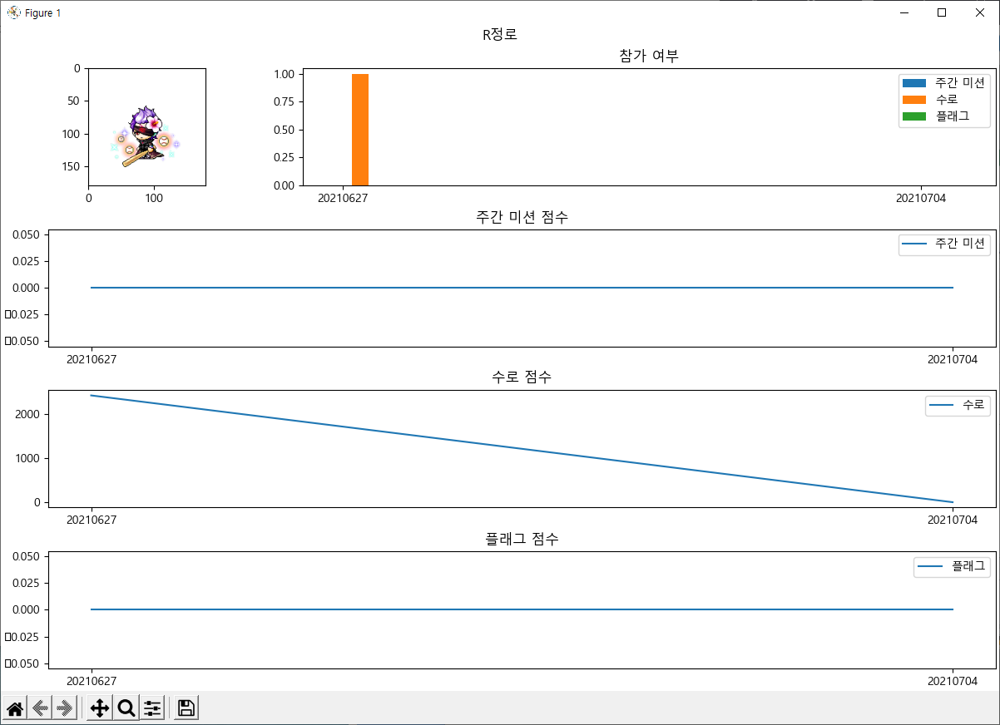

    8. 화면이동 버튼입니다.
    하단의 매뉴를 통해 첫 화면으로 돌아갈 수 있습니다.

##### 4.5
##### 엑셀파일

    프로그램을 실행하게 된다면 다음과 같은 파일이 생성될 것 입니다.

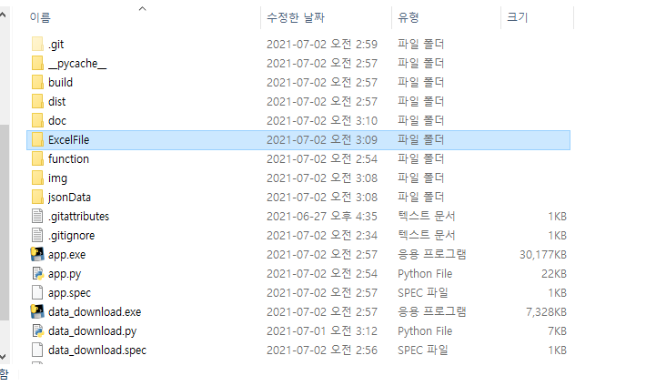

    폴더내의 엑셀파일은 입력한 길드의 이름으로 생성됩니다.

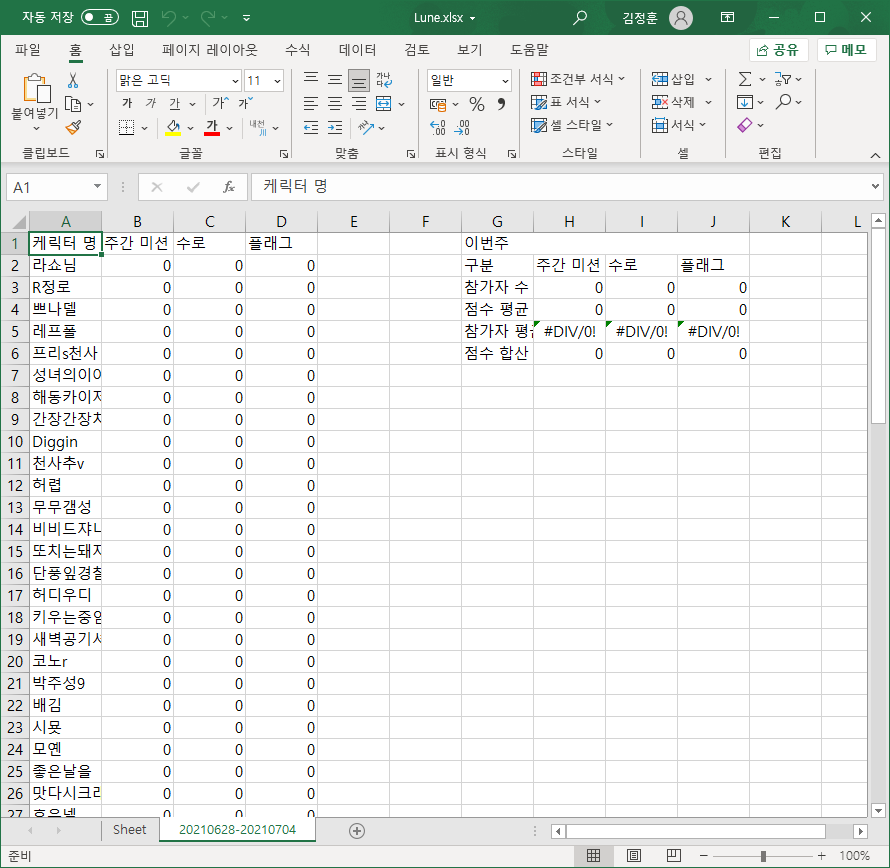
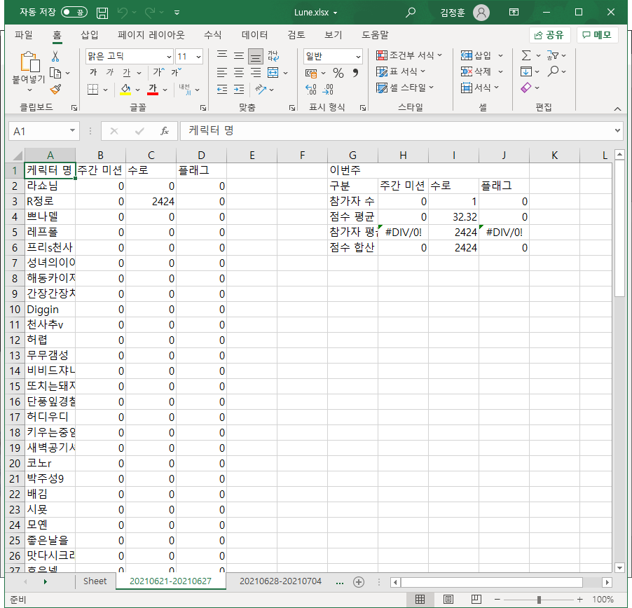
    
    첫주차에는 저런 시트가 생성될 것입니다.
    왜냐하면 이전 주차의 시트가 없기 때문에 이전주차의 데이터를 가져올 수 없기 때문입니다.

    2주차부터는 정상적으로 다음과 같은 시트가 생성될 것 입니다.

##### 4.6
##### 화면인식 자동입력

    메이플 인게임내 화면을 인식하여 엑셀에 자동 입력합니다.
    매인 화면의 화면 캡쳐 버튼을 클릭하면 실행됩니다.

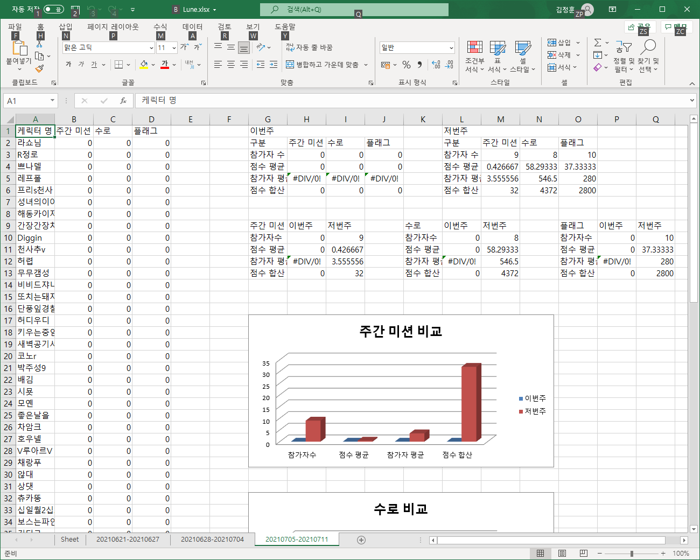

    스캔 프로그램 실행 전입니다.

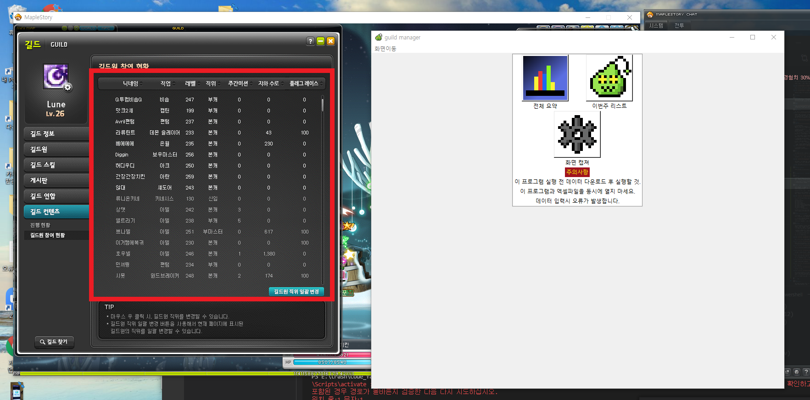

    프로그램의 위치와 메이플의 화면 위치는 어디든 상관은 없습니다.
    그러나 반드시 저 빨간 박스는 화면에서 보이는 상태여야 합니다.

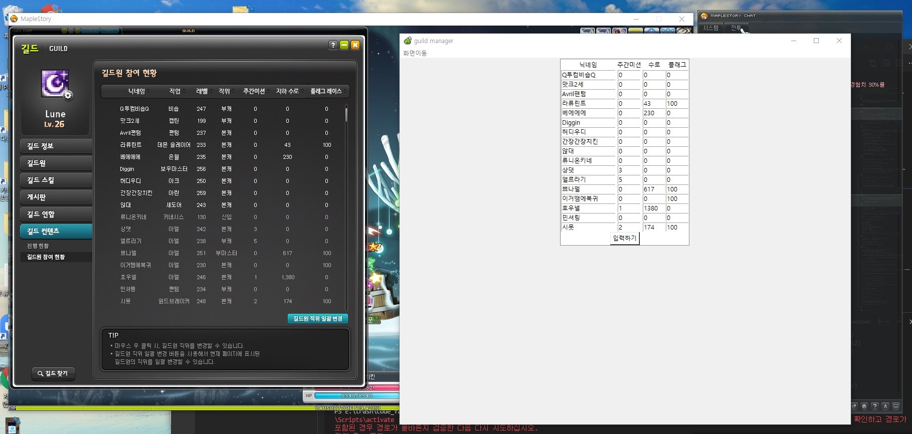

    스캔이 완료된 모습입니다.
    간혹 인식이 재대로 되지 않아서 이상한 값이 입력될 때가 있습니다.
    이를 막기 위해서 입력전 오류는 수정을 해줍니다.
    수정까지 끝마쳤으면 입력하기 버튼을 누르면 됩니다.

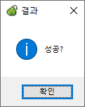

    이 단계까지 정상적으로 완료되었다면 위의 메시지가 뜨고 확인을 누르면 처음 화면으로 돌아갑니다.

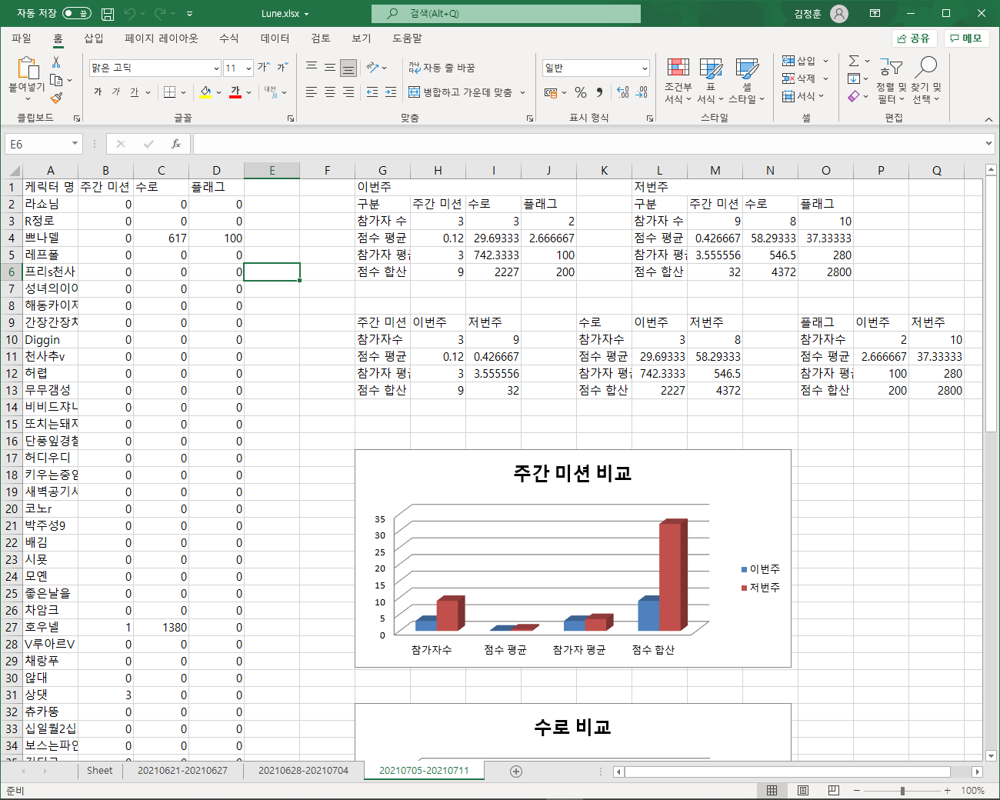

    이후 엑셀파일의 모습입니다.

### 5
### 화면 캡쳐를 통한 엑셀 시트 입력 설정

##### 5.1
##### 숙지사항
    
    이 기능을 사용하려면 exe 파일이 아닌 직접 python 스크립트를 실행해야 한다.
    그리고 google cloud의 vision api를 통해서 OCR(이미지 텍스트 추출)을 한다.
    따라서 이 기능을 사용하기 전에 별도로 진행해야할 작업이 있다.

    1. python 설치 및 라이브러리 설치
    2. vision api key 받아오기

##### 5.2
##### 파이선 설치 및 라이브러리 설치

    파이썬 설치에 대한 자료는 구글링 해보면 많이 나오겠지만
    그 중 하나의 링크를 띄우겠다.
    https://wikidocs.net/8

    자료에서는 3.7이라 되있지만 그냥 3.9 버전 다운로드 받으면 된다.

    설치가 완료되었다면, 윈도우키 + R 키를 누른 이후 cmd를 쳐서 dos 창에 가자.
    그리고 python --version, pip --version 을 쳐보자.

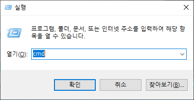
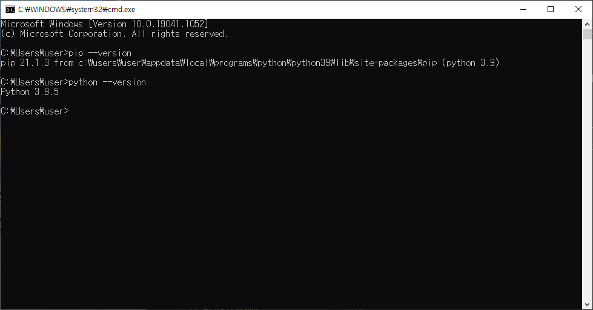

    다음과 같이 결과가 나왔다면 정상적으로 설치되었다.

    이후 dos 창에서
    pip install pillow
    pip install tk
    pip install numpy
    pip install matplotlib
    pip install google-cloud-storage
    pip install --upgrade google-cloud-vision
    pip install pyautogui
    pip install openpyxl
    를 쳐서 차례대로 설치해주자.

    프로그램 파일이 있는 폴더로 가서
    그 다음 app.py 파일을 실행시켜서 프로그램이 정상적으로 켜지면 1단계 완료이다.

##### 5.3 
##### google cloud vision 설정

    이 프로그램은 구글 클라우드의 vision을 사용한다.
    따라서 앱의 키를 받아올 필요성이 있다.

    구글 클라우드 플랫폼에 접속하자.
    https://cloud.google.com/

    이후 무료로 시작하기를 선택하고 가입하자.

###### 5.3.1
###### 결제설정 관련

    결제가 들어간다해서 혹여나 과금이 발생할까 걱정이 된다면,
    앵간해선 그럴일 없으니 접어두라 할 수 있다.
    vision 의 과금은 1000건 부터 과금이되고,
    만약 과금이 된다 하더라도, 1000건당 2~3천원정도 발생하게 된다.

    일주일에 약 250번을 써야 과금이 발생한다는 것인데, 화면 인식을 일주일에 많아봐야,
    몇십번밖에 사용하지 않을것이니 이는 걱정하지 않아도 좋다. (이미지 캡쳐 1회당 1번)

    먼저 왼쪽상단의 매뉴바에서 결제 > 결제 수단으로 들어가서 자신의 카드를 등록한다.

    다음으로 api 설정을 하자.

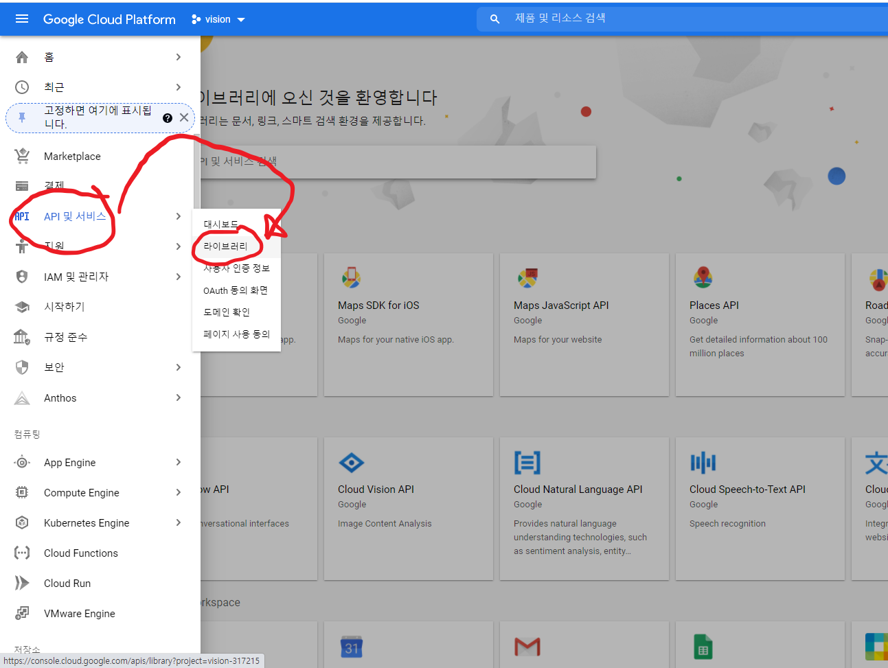
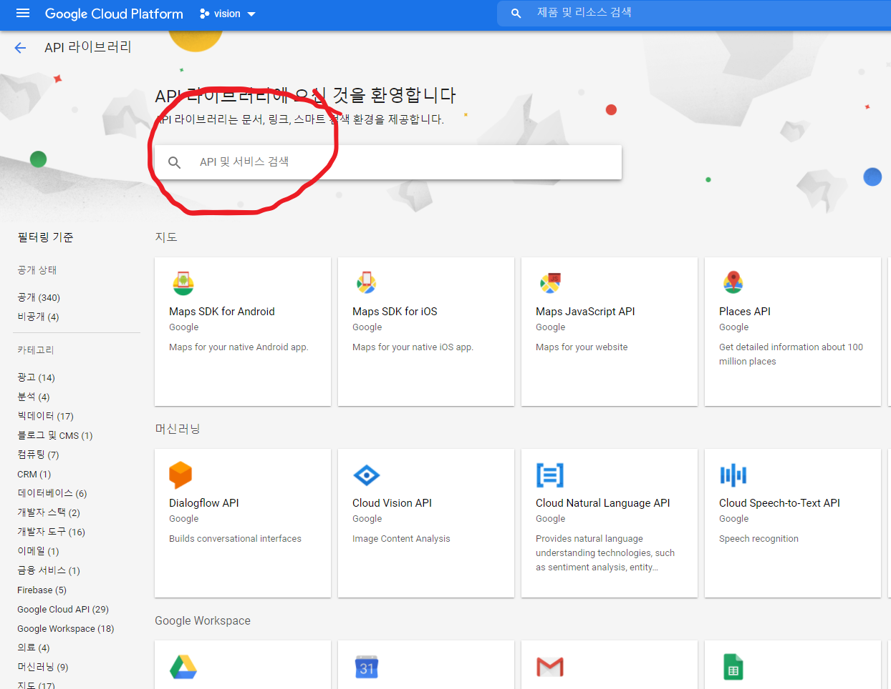

    다음과 같이 라이브러리에 들어가 vision을 검색해서 사용을 눌러준다.

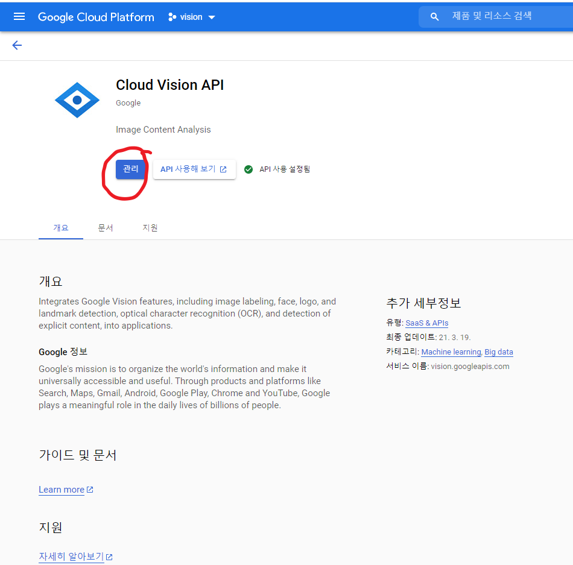

    필자는 아마 이미 사용자라 관리라 뜰 것이다.
    만약 프로젝트 설정이 뜬다면 my first porject에 하던지 새로 만들던지는 사용자 마음대로 하면된다.

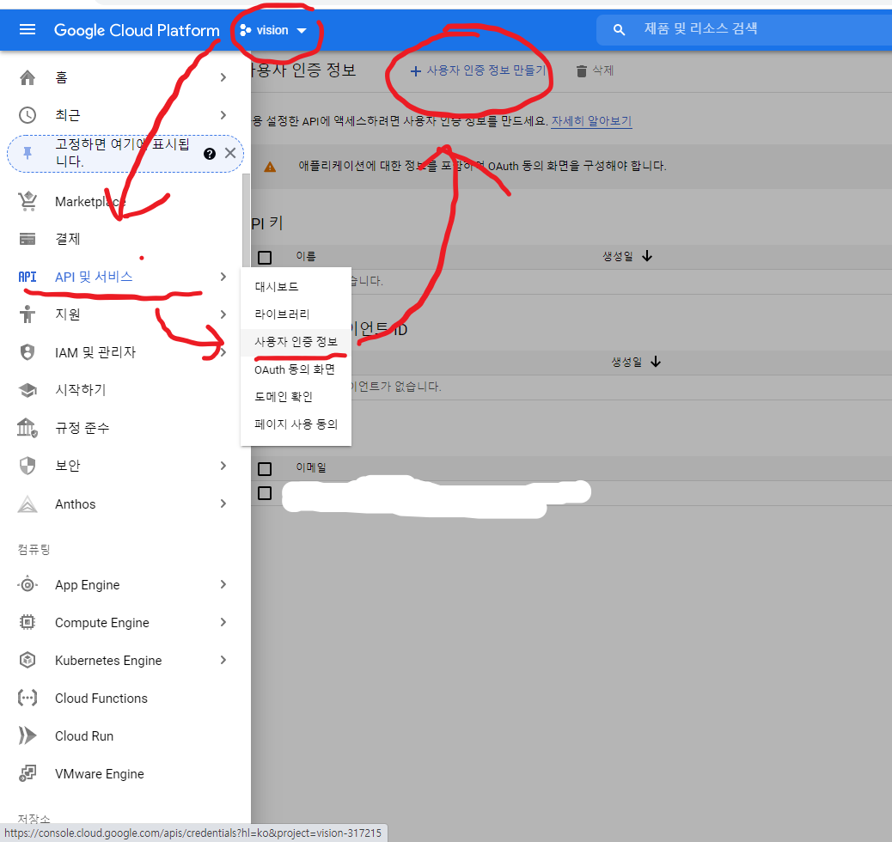

    다음으로 vision 을 사용하는 project 에서 사용자 인증정보로 들어간다.
    

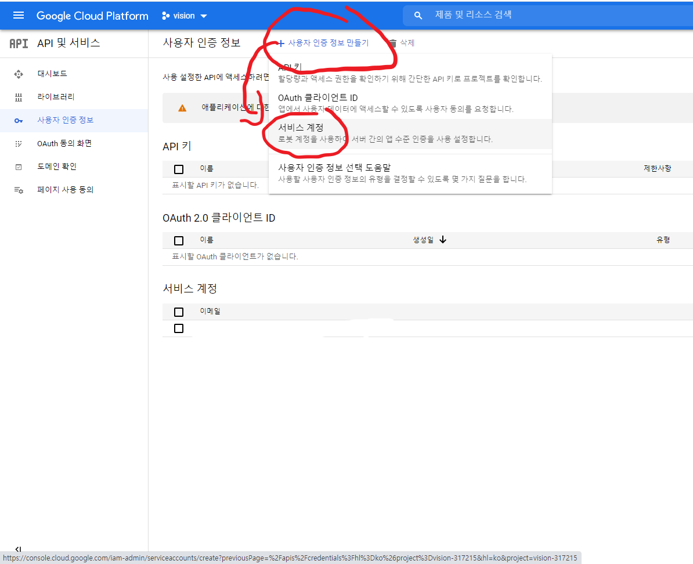

    그 곳에서 사용자 인증정보 만들기를 클릭한다

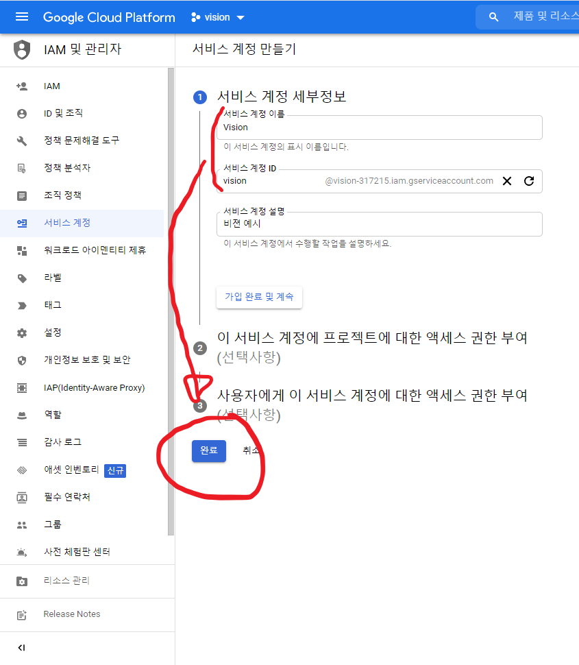

    이후 서비스 계정이름과 계정 ID를 적당히 입력해준다

    그러면 서비스계정이 생성될 것 이다. (바로는 아니고 시간이 조금 걸린다.)

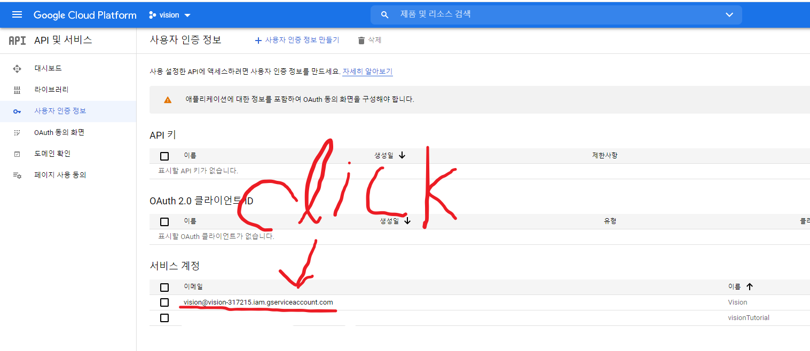

    계정이 생성되었다면 클릭하자.

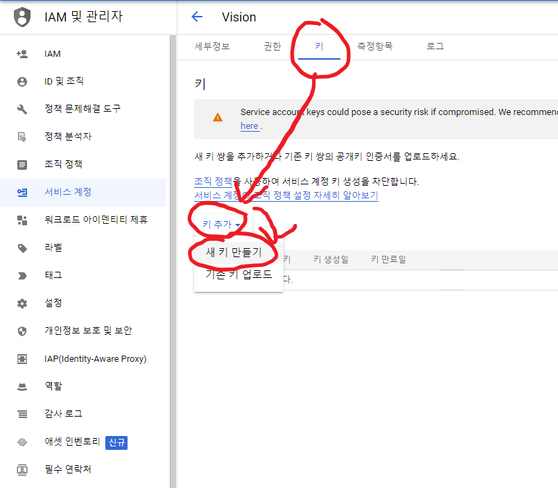

    키를 생성한다.

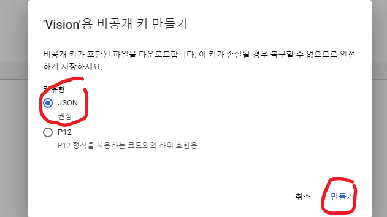

    json 을 선택한다.

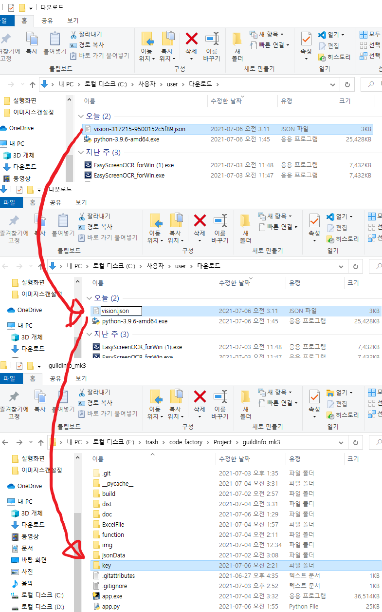

    그러면 키파일이 다운로드 파일에 다운로드 될 것이다.
    이 키파일의 이름을 vision.json 으로 변경하자.
    그다음 파일을 프로그램 폴더의 key 폴더에 집어넣자.

    그러면 프로그램이 정상 작동할 것 이다.

### 6
### 데이터 갱신

    data_download.exe 를 다시한번 실행시킵니다.
    그러면 최근의 길드 정보를 갱신합니다.
    
    이후 프로그램 내의 이번주 리스트에 들어가서 처음부터 끝까지 리스트를 돌아보면
    엑셀에도 반영이 됩니다.
    

### 7
### 업데이트 로그

##### 7.1
##### 2021.07.02 
    
    수로 점수 문자 입력시 오류 발생 문제 해결
    플래그 점수 300점 버튼 추가

##### 7.2
##### 2021.07.04

    google vision 을 통한 화면캡쳐로 입력하기 기능 추가. 
    (exe파일은 안됨, python 직접 컴파일해야됨.)

### 8
### 그외

    데이터 다운로드 이후, img 폴더의 charImg 파일안에는 케릭터 이미지들이 저장된다.
    필요하면 복사해서 가져가자.
    물론 임의로 파일들을 변경하면 프로그램이 정상적으로 동작하지 않을 수 있다.
    jsonData 파일내에는 길드 케릭터들의 정보가 json 형태로 저장된다.
    직위, 이미지 링크주소, 닉네임, 직업, 레벨, 경험치, 인기도,
    무릉도장 최고점수, 무릉도장 최근점수 등의 정보가 저장되어있다.
    쓸모없어보이는 정보들이 왜 저장되나면, 
    이전 프로램에서 사용했던 코드인데, 이전에는 수로에서 무릉층수 파악도 중요한 정보증 하나였기 때문이다.

