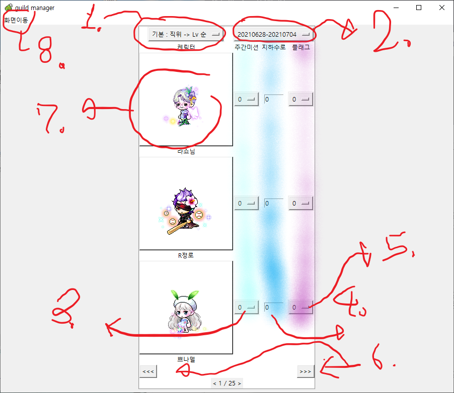

# 길드 주간 기록지 mk3

### 1
### 개요
    이 프로그램은 최근에 개편된 길드 시스템에 대하여
    편리하게 길드 기록을 관리하기 위해 제작되었습니다.

### 2
### 기능
    1. 길드의 데이터를 크롤링해와서 저장후 활용합니다.
    2. 가져온 데이터를 기반으로 엑셀파일을 생성하고, 이와 프로그램끼리 연동하여 기록합니다.
    3. 프로그램을 통하여 입력하고 기록들을 그래프로 볼 수 있습니다.
    4. 저장된 기록들은 엑셀파일로 볼 수 있습니다.

    실행 화면

### 3
### 설치

    먼저 파일을 다운로드 받습니다.

    
    zip 파일을 풉니다.

    이후 폴더내의 data_download.exe 실행파일을 실행시킵니다.

    실행시키면 콘솔 화면이 뜰 것 입니다.

    여기서 시키는대로 길드 이름과 월드를 입력해줍시다.

    정상적으로(존재하는 길드를) 입력을 했다면, 데이터가 다운로드될 것 입니다.

    완료가 되었다면, 이제 app.exe 파일을 실행시킴으로써 프로그램을 실행할 수 있게됩니다.

### 4
### 사용 설명서

##### 4.1
##### 주의사항
    exe파일 등의 위치를 변경하면 정상적으로 동작하지 않을 수 있습니다.
    첫 화면에서도 적혀있지만, 생성된 엑셀파일을 열어두고 프로그램을 실행 시,
    데이터 입력과정에서 오류가 발생합니다.

##### 4.2
##### 실행

    이전의 설치과정을 정상적으로 완료하였다면,
    프로그램 실행시 위의 화면이 뜰 것 입니다.

##### 4.3
##### 기록 요약창

    처음 실행 시, 전체요약 버튼을 누르면 아래의 화면이 나올 것 입니다.

    그런데, 위의 사용예시에서  본 화면과 다릅니다.
    그 이유는 아직 데이터가 1주차 시트밖에 생성되지 않았기 때문입니다.
    프로그램상에서 실행 시 자동적으로 날짜를 파악하여 해당 주차의 시트를 생성하는데,
    아마 다음주에 프로그램을 실행시키게 된다면 다음의 화면이 될 것 입니다.

##### 4.4
##### 입력화면

    
    1. 정렬기능입니다.
    데이터를 다운받을때의 기본순서, Lv 높은 순, 이름순으로 정렬가능합니다.
    레벨순으로 정렬 시 같은레벨끼리는 인게임에서의 정렬이 일치하지 않을 수 있습니다.
    
    2. 원하는 주차 데이터를 불러올 수 있습니다.
    20210627-20210704
    2021년 06월 27일(월) - 2021년 07월 04일(일) 을 뜻합니다.
    
    3. 주간 미션 값을 입력하는 곳 입니다.
    버튼을 눌러 선택하면 자동으로 저장이 됩니다.

    4. 지하수로 점수를 입력하는 칸입니다.
    숫자를 입력한 이후 엔터키를 눌러야 데이터가 저장됩니다.

    5. 플래그 점수 입력 버튼입니다.
    주간미션버튼칸과 마찬가지로 입력하려는 값을 클릭하면 자동 저장됩니다.

    6. 페이지 이동 버튼입니다.
    정렬된 순서대로 다음 케릭터들을 보여줍니다.

    7. 해당 케릭터의 참가기록을 그래프로 보여줍니다.
    케릭터를 클릭하면 새로운 창에서 정보를 띄워줍니다.

    8. 화면이동 버튼입니다.
    하단의 매뉴를 통해 첫 화면으로 돌아갈 수 있습니다.

##### 4.5
##### 엑셀파일

    프로그램을 실행하게 된다면 다음과 같은 파일이 생성될 것 입니다.

    폴더내의 엑셀파일은 입력한 길드의 이름으로 생성됩니다.

    
    첫주차에는 저런 시트가 생성될 것입니다.
    왜냐하면 이전 주차의 시트가 없기 때문에 이전주차의 데이터를 가져올 수 없기 때문입니다.

    2주차부터는 정상적으로 다음과 같은 시트가 생성될 것 입니다.

##### 5
##### 그외

    데이터 다운로드 이후, img 폴더의 charImg 파일안에는 케릭터 이미지들이 저장된다.
    필요하면 복사해서 가져가자.
    물론 임의로 파일들을 변경하면 프로그램이 정상적으로 동작하지 않을 수 있다.
    jsonData 파일내에는 길드 케릭터들의 정보가 json 형태로 저장된다.
    직위, 이미지 링크주소, 닉네임, 직업, 레벨, 경험치, 인기도,
    무릉도장 최고점수, 무릉도장 최근점수 등의 정보가 저장되어있다.
    쓸모없어보이는 정보들이 왜 저장되나면, 
    이전 프로램에서 사용했던 코드인데, 이전에는 수로에서 무릉층수 파악도 중요한 정보증 하나였기 때문이다.

